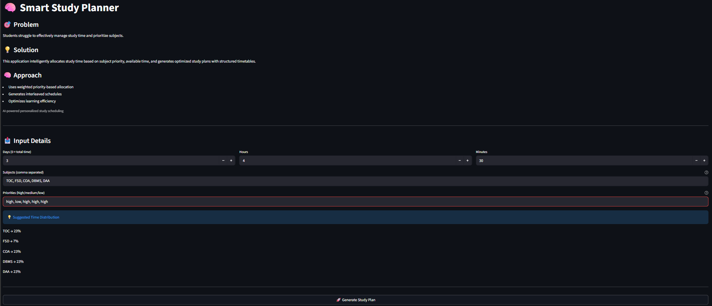
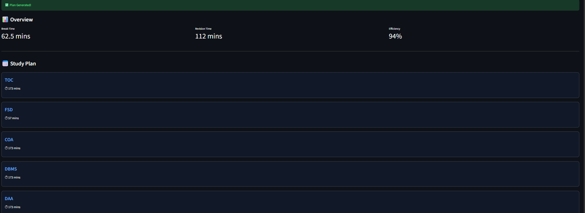
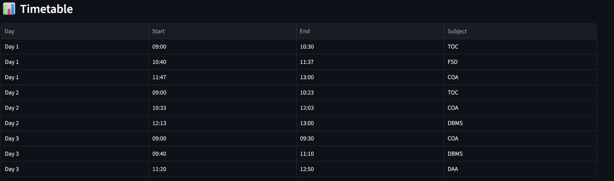

# 🧠 Smart Study Planner Assistant

🚀 Built with Streamlit + Google Calendar API + Intelligent Scheduling Logic  

An AI-powered intelligent assistant that dynamically generates personalized study schedules based on time availability, subject priority, and user intent — with real-time Google Calendar integration.

---

## 🎯 Challenge Vertical
**Productivity / Education**

---

## 👤 Target Persona
Engineering students preparing for exams, assignments, and projects who struggle with:
- Time management  
- Subject prioritization  
- Adapting study plans dynamically  

---

## ❗ Problem Statement

Students often:
- Do not know how to divide limited time efficiently  
- Fail to prioritize subjects based on importance  
- Cannot adapt schedules when time constraints change  
- Lack structured and actionable study plans  

---

## 💡 Solution Overview

The **Smart Study Planner Assistant** solves this by:

- Dynamically allocating time based on subject priority  
- Supporting both manual input and natural language (AI Mode)  
- Generating optimized time-slot schedules  
- Providing efficiency scoring and improvement suggestions  
- Automatically converting schedules into real-time Google Calendar events  

---

## 🚀 Core Features

- ✅ Priority-Based Scheduling (High / Medium / Low)  
- ✅ AI Mode (Natural Language Input Parsing)  
- ✅ Dynamic Time Allocation Algorithm  
- ✅ Break & Revision Optimization  
- ✅ Time-Slot Generation (Structured Study Flow)  
- ✅ Plan Efficiency Scoring System  
- ✅ AI-Based Study Suggestions  
- ✅ Google Calendar API Integration  
- ✅ PDF Export of Timetable  
- ✅ Clean Streamlit UI  

---

## 🧠 Intelligent Decision-Making Logic

The assistant uses layered decision-making:

- 🔹 NLP Parsing → Extracts subjects & priorities  
- 🔹 Weighted Allocation Algorithm → Distributes time proportionally  
- 🔹 Adaptive Scheduling → Adjusts based on available time  
- 🔹 Efficiency Scoring → Evaluates quality of study plan  
- 🔹 AI Suggestions → Improves learning outcomes  

> This ensures **context-aware dynamic planning**, not static scheduling.

---

## ⚙️ System Workflow

1. User enters time, subjects, priorities  
2. System calculates weighted distribution  
3. Generates optimized study plan  
4. Creates interleaved timetable  
5. Outputs:
   - Study plan  
   - Timetable  
   - Efficiency score  
   - Calendar events  

---

## 🌐 Live Demo

🔗 https://promptwars-r86ripmbuk27tyamz5jx62.streamlit.app/

---

## 📸 Screenshots

### 🔹 Input Interface


### 🔹 Study Plan Output


### 🔹 Timetable View


---

## 📅 Google Calendar Integration

This project integrates with **Google Calendar API** to:

- Automatically create study sessions as calendar events  
- Schedule tasks sequentially with accurate timing  
- Trigger notifications at session start time  

### 🔐 Setup Instructions:
1. Go to Google Cloud Console  
2. Enable Google Calendar API  
3. Create OAuth credentials  
4. Download and rename file to `my_credentials.json`  
5. Place it in the project root  
6. Run the application and authenticate  

⚠️ Credentials are not included in the repository for security reasons.

---

## 🏗️ Project Structure

```plaintext
project-root/
│
├── app_streamlit.py           # Main UI (Streamlit app)
├── scheduler.py               # Core scheduling engine
├── calendar_integration.py    # Google Calendar integration
├── prompt_parser.py           # NLP processing
├── utils.py                   # Helper functions
├── requirements.txt           # Dependencies
├── README.md
│
└── assets/
    └── screenshots/
        ├── input.png
        ├── plan.png
        ├── table.png
```
## ▶️ How to Run
1. Install dependencies
pip install -r requirements.txt
## 2. Run the application
streamlit run app_streamlit.py
## 🔐 Security Considerations
Credentials (my_credentials.json, token.json) are excluded via .gitignore
No sensitive data is stored in the repository
OAuth authentication ensures secure access
## ⚡ Performance & Efficiency
Lightweight implementation (<1MB repository)
No heavy frameworks
Optimized scheduling algorithm
Fast execution
## 🧪 Testing & Validation
Tested for:

Manual input scenarios
AI-based natural language input
Edge cases (low time, equal priority)
Google Calendar integration

## 🌍 Real-World Impact
This project helps students:
Improve productivity
Make better time decisions
Reduce planning stress
Follow structured learning

## 💡 Why This Project Stands Out
Combines AI + scheduling + automation
Supports both structured & natural input
Implements intelligent decision-making logic
Integrates real-world Google services
Provides actionable insights, not just static output
Clean, modular, and scalable design

## 🚀 Future Enhancements
Performance tracking dashboard
Adaptive learning system
Analytics integration
Google Sheets integration

## 🏁 Conclusion

The Smart Study Planner Assistant demonstrates how AI-driven decision-making combined with real-world integrations can create impactful productivity tools.

It is scalable, practical, and designed for real users — not just a prototype.
