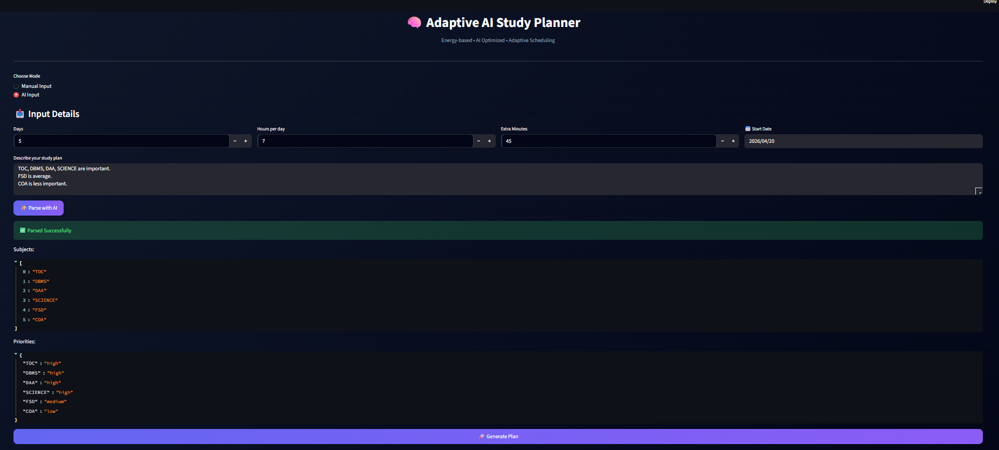

# 🧠 Adaptive AI Study Planning System

> 🚀 A hybrid AI system that generates, critiques, and optimizes personalized study plans using a multi-agent pipeline.

---

## ⚡ Overview

This project is an **AI-driven study planning system** that goes beyond traditional schedulers by combining:

- 📊 Rule-based time allocation  
- 🤖 LLM-powered reasoning  
- 🔁 Multi-agent feedback loops  

👉 The result: **optimized, adaptive, and continuously refined study plans**

---

## 🎯 Problem

Students struggle with:
- Poor time management  
- Lack of prioritization  
- Static and ineffective study schedules  

---

## 💡 Solution

This system generates **dynamic, priority-based study plans** using:

- Natural language input (AI parsing)
- Weighted scheduling algorithms
- AI critique + optimization loops

👉 Not just a planner — a **decision-making system**

---

## 🧠 Core Innovation

### 🔹 Multi-Agent AI Pipeline

```text
User Input  
   ↓  
AI Parser (LLM extraction)  
   ↓  
Rule-Based Scheduler  
   ↓  
Critic Agent → identifies inefficiencies  
   ↓  
Optimizer Agent → refines schedule  
   ↓  
Evaluator Agent → scores efficiency  
   ↓  
Final Optimized Plan  
```

---

### ✨ What Makes It Unique

- Multi-agent prompt engineering (Planner → Critic → Optimizer → Evaluator)
- Hybrid AI system (deterministic + LLM reasoning)
- Iterative plan refinement using feedback loops
- Context-aware scheduling (not static timetables)

---

## 🧠 Key Technical Challenges & Solutions

- **Ambiguous user input**  
  → Solved using LLM-based subject & priority extraction  

- **Balancing AI vs algorithmic control**  
  → Hybrid system ensures stability + intelligence  

- **Multi-agent coordination**  
  → Designed structured pipeline for Critic → Optimizer flow  

- **Maintaining schedule consistency after AI changes**  
  → Post-optimization validation ensures feasibility  

---

## 🚀 Features

- ✅ Priority-Based Scheduling (High / Medium / Low)  
- ✅ Natural Language Input (AI Mode)  
- ✅ Dynamic Time Allocation Algorithm  
- ✅ AI Critique & Optimization  
- ✅ Efficiency Scoring System  
- ✅ Structured Timetable Generation  
- ✅ Google Calendar Integration  
- ✅ PDF + CSV Export  
- ✅ Study Analytics Visualization  
- ✅ Progress Tracking  
- ✅ Tested with unit tests covering scheduling edge cases
- ✅ Efficiency Score → Evaluates plan quality based on priority alignment, time balance, and study distribution

---

## 🛠️ Tech Stack

- **Frontend:** Streamlit  
- **Backend:** Python  
- **Scheduling Engine:** Custom Weighted Algorithm  
- **AI Layer:** LLM-based multi-agent system  
- **Visualization:** Pandas + Altair  
- **Integration:** Google Calendar API  

---

## 🔄 How It Works

1. User provides:
   - Subjects + priorities OR natural language input  

2. AI Parser:
   - Extracts structured data using LLM  

3. Scheduler:
   - Allocates time using weighted distribution  

4. AI Layer:
   - Critic detects inefficiencies  
   - Optimizer improves plan  
   - Evaluator scores effectiveness  

5. Output:
   - Study plan  
   - Timetable  
   - Efficiency score  
   - Calendar events  
   - Analytics  

---
## 📊 Sample Input → Output

### 🔹 Input
- Subjects: TOC (High), FSD (Medium), AI (Low)
- Available Time: 6 hours
- Mode: AI Input → "Focus more on TOC and FSD"

### 🔹 Output (Generated Plan)
- TOC → 3 hours  
- FSD → 2 hours  
- AI → 1 hour  

### 🔹 AI Improvements
- Added revision slots for high-priority subjects  
- Balanced study flow using interleaving  
- Inserted breaks to reduce fatigue  

### 🔹 Efficiency Score
**8.7 / 10** → Strong priority alignment with balanced workload

> ⚡ Plans are iteratively improved until efficiency score stabilizes
---

## 📊 Example Output

- Optimized study timetable  
- AI-generated improvement suggestions  
- Efficiency score (plan quality metric)  
- Exportable formats (PDF, CSV, Calendar)

---

## 🌐 Live Demo

🔗 https://promptwars-r86ripmbuk27tyamz5jx62.streamlit.app/

---

## 🎥 Demo Video

[](https://www.youtube.com/watch?v=rLS3vJWCYyY)

▶️ Demonstrates:
- AI-based subject parsing  
- Smart schedule generation  
- Multi-agent optimization (Critic → Optimizer → Evaluator)  
- Timetable + analytics output  
- Google Calendar integration  

👉 Fully functional deployed app with real-time AI scheduling
---

## 📸 Screenshots

### 🔹 Input Interface


### 🔹 Study Plan Output


### 🔹 Timetable View


### 🔹 AI Mode


---

## 🏗️ Project Structure

```plaintext
project-root/
│
├── app_streamlit.py           # Main UI (Streamlit app)
├── scheduler.py               # Core scheduling engine
├── calendar_integration.py    # Google Calendar integration
├── prompt_parser.py           # NLP processing
├── utils.py                   # Helper functions
├── requirements.txt           # Dependencies
│
├── tests/
│ └── test_scheduler.py        # Unit tests
│
└── assets/
    └── screenshots/
        ├── input.png           # Input Interface
        ├── plan.png            # Study Plan Output
        ├── table.png           # Timetable View
        ├── ai_input.png        # AI Mode
         
```
---

## ⚙️ Setup

### 1️⃣ Install dependencies
```bash
pip install -r requirements.txt
```
### 2️⃣ Run the app
```bash
streamlit run app_streamlit.py
```
## 📅 Google Calendar Integration
- Auto-creates study sessions as events
- Sequential scheduling with accurate timing
- Notification support

## 🔐 Security
- Credentials excluded via .gitignore
- OAuth authentication used
- No sensitive data stored

## 🧪 Testing
- Unit tests using pytest
- Covers scheduling logic & edge cases
- ✅ All tests (6/6) passing

## ⚡ Performance
- Lightweight (<1MB)
- Fast execution
- Optimized scheduling logic

## ⚠️ Limitations
- Dependent on LLM API availability
- Requires API key setup
- No persistent storage (session-based)

## 🌍 Real-World Impact

Helps students:
- Improve productivity  
- Reduce planning stress  
- Focus on high-priority subjects  
- Follow structured learning routines  

## 🚀 Future Work
- Adaptive learning system
- Performance analytics dashboard
- Google Sheets integration
- Long-term progress tracking

## 🏁 Conclusion

This project demonstrates how AI + algorithmic systems can be combined to build practical, real-world productivity tools.

An adaptive AI planning system, not just a traditional scheduler.
